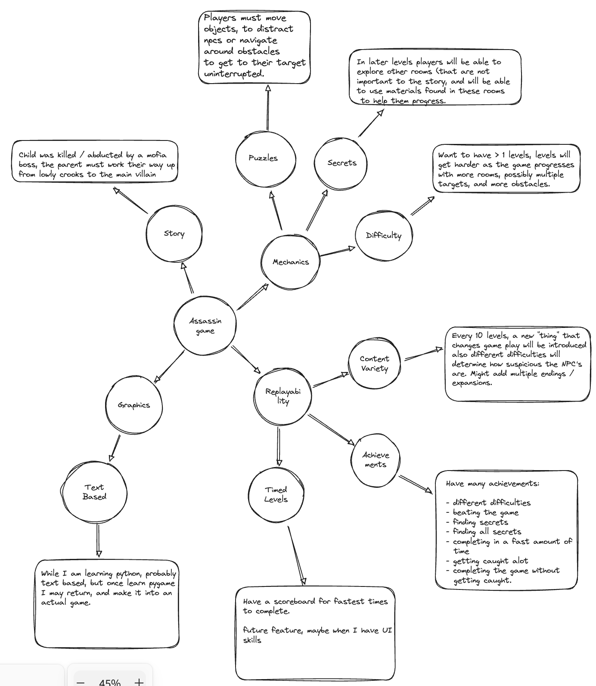

# Text Based Adventure

## Plan:

1. Topic: Come up with a topic for the game.

2. Mind Map: Come up with ideas for game mechanics

3. UML: Come up with a plan for classes

4. Skeleton Code: Create a brief plan, with comments

5. Tests: Write Tests for the functions that you will create

6. Code: Write the code, fix problems that you come across

7. Bugs: Fix, Format and Refactor Code

8. Celebrate

### 1. Topic:

Reverse of Murder Mystery, you have a target and need to eliminate them.
Assassin style game.

### 2. Mind Map:

### 3. UML

**Rooms**

-   Puzzle

-   NPC

-   Object

    -   Vents
    -   Chests

-   Obstacle
    -   Locked Doors
    -   Cameras

**Characters**

-   NPC

    -   Maids
    -   Crooks
    -   Dealers
    -   Workers
    -   Guards
    -   Dogs

-   Target

-   Character

**Items**

-   Vase
-   Laser Pointer
-   Ball
-   Squeaky Toys
-   Bribes

**Saving**

-   Save
-   Load from Save
-   Delete Save
-   Recover Save
-   Force Delete

**...**

## Rules Description:

## Game Play:

## Wish List
